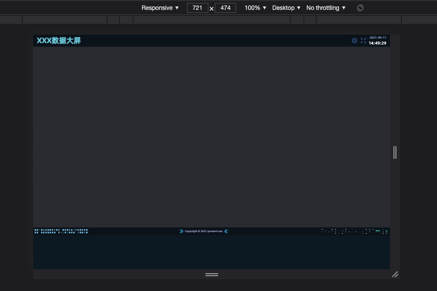

# 大屏屏幕适配方案

> 创建时间 2021 年 09 月 11 日

前不久公司需要做一个数据大屏，因此借机去研究了一下市面上的大屏屏幕适配方案，其实也就看了百度的 **Sugar** 和阿里的 **DataV**，分析了一遍后大概（自我感觉 🤦‍♂️）知道了他们的适配方案

## 方案

总的来说，两家的适配方案基本上都一致。都是使用 css3 的 `scale` 属性来缩放。

具体思路是：首先把 **"根元素"** 按设计稿设置宽高即 1920 \* 1080，然后动态的根据屏幕的实际高来设置 `scale` 的值。

```ts
// 屏幕的实际宽高
const { clientHeight: height } = document.documentElement

// 计算出实际高与定稿高的比率
const ratioY = height / 1080

// 最后把 scale 设置到根元素上即可
root.style.transform = `scale(${ratio})`
```

到这里就基本上完成了基本的适配了，但是他们这方案也存在一些明显的不足点

## 不足点

两家的方案都只是取高度来计算缩放比率，这会在一些奇怪非 16:9 的屏幕上出现左右两边被裁切的情况。因此稍微改进了一下，采用了类似 contain 的方式，确保屏幕的最短边能够完全展示出来，避免裁切的问题。

<div align="center">
  
</div>

```ts
// 屏幕的实际宽高
const { clientWidth: width, clientHeight: height } = document.documentElement
// 计算出实际宽与定稿宽的比率
const ratioX = width / 1920
// 计算出实际高与定稿高的比率
const ratioY = height / 1080
// 取最小的比率，确保能完全显示(即确保最短边的展示，类似 contain 的效果)
const ratio = Math.min(ratioX, ratioY)

root.style.transform = `scale(${ratio})`
```

到了这一步，缩放比的问题已经解决了，无论在什么比例的屏幕上都能确保不会出现裁切的情况。

但是你以为这就完了，其实还会有一个问题，就是会导致内容不居中。

<div align="center">
  
  <br />
  
  <br />
  <b> 效果图 <b>
</div>

## 改进版

其实，这也很好解决，既然不居中，那我们就居中就完事了（😁），过程也很简单，直接看代码就行了。

```ts
const root = document.querySelector(rootSelector) as HTMLElement
const { clientWidth: width, clientHeight: height } = document.documentElement
const { clientHeight, clientWidth } = root
const ratioX = width / 1920
const ratioY = height / 1080
const ratio = Math.min(ratioX, ratioY)

root.style.transform = `scale(${ratio})`

// 计算出屏幕大小与根节点缩放后的大小的差值再除以一半，即可得到居中的偏移量
root.style.marginTop = `${(height - clientHeight * ratio) / 2}px`
root.style.marginLeft = `${(width - clientWidth * ratio) / 2}px`
```

<div align="center">
  
  <br />
  
  <br />
  <b> 效果图 <b>
</div>

## 坑点

如果你是使用 `requestFullscreen` 来进入全屏的话，请不要把 `scale` 设置到你要全屏显示模式的元素身上，因为 `Chrome` 会强制给全屏元素一些样式。

```ts
document.body.requestFullscreen()
```

<div align="center">
  
</div>

解决方案：比如你要使 body 进入全屏的，那么只要把 `scale` 放到 body 的子元素即可

```html
<body>
  <!-- scale 设置在 #app 上 -->
  <div id="app"></div>
</body>
```

## 总结

至此，大屏的适配就基本上完成了。相比于 Rem 方案来说，此方法可以兼容一些较小的屏幕（较小的屏幕哪能叫大屏 哈哈哈哈）。比较浏览器有默认最小字体， Rem 的话可能会导致文字比预想的要大，导致布局出现问题。

不过，该方案也不是完美的，缺点在于屏幕比例不是 16:9 的情况下，上下左右会出现留白的情况。这个，等到有时间时再研究一下，还有没有更优的解决方案。

## 最后

放一个完整版的代码。简单的封装成了 composition-api 方便以后使用

```ts
import _throttle from "lodash/throttle"
import { onMounted, onUnmounted } from "vue"

export const useScale = (rootSelector = "#app") => {
  const setAppScale = _throttle(() => {
    const root = document.querySelector(rootSelector) as HTMLElement
    const { clientWidth: width, clientHeight: height } = document.documentElement
    const { clientHeight, clientWidth } = root
    const ratioX = width / 1920
    const ratioY = height / 1080
    const ratio = Math.min(ratioX, ratioY)

    root.style.transform = `scale(${ratio})`
    root.style.marginTop = `${(height - clientHeight * ratio) / 2}px`
    root.style.marginLeft = `${(width - clientWidth * ratio) / 2}px`
  }, 100)

  onMounted(() => {
    const root = document.querySelector(rootSelector) as HTMLElement
    root.style.width = "1920px"
    root.style.height = "1080px"
    root.style.overflow = "hidden"
    root.style.transformOrigin = "left top 0"

    setAppScale()
    window.addEventListener("resize", setAppScale)
  })

  onUnmounted(() => {
    window.removeEventListener("resize", setAppScale)
  })
}
```
